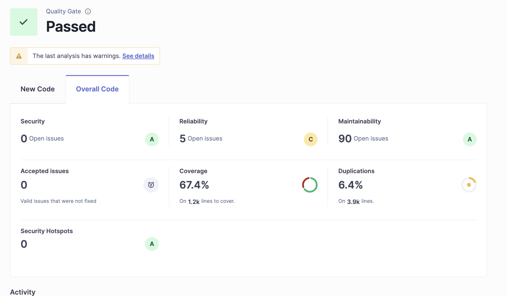
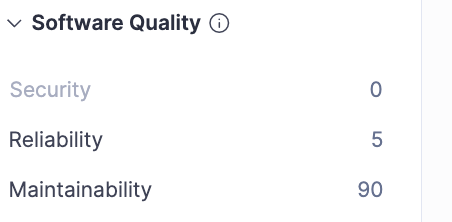
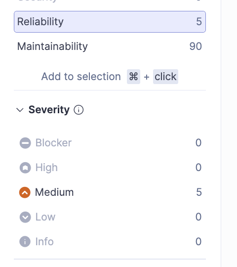
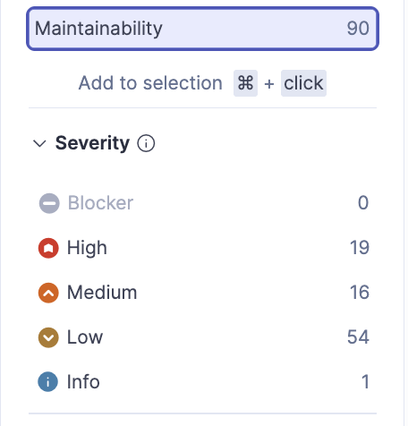
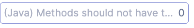
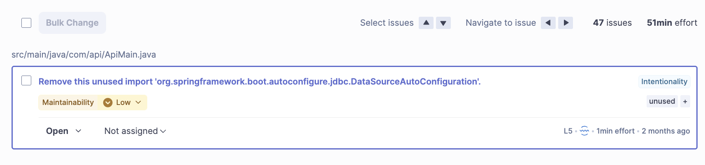
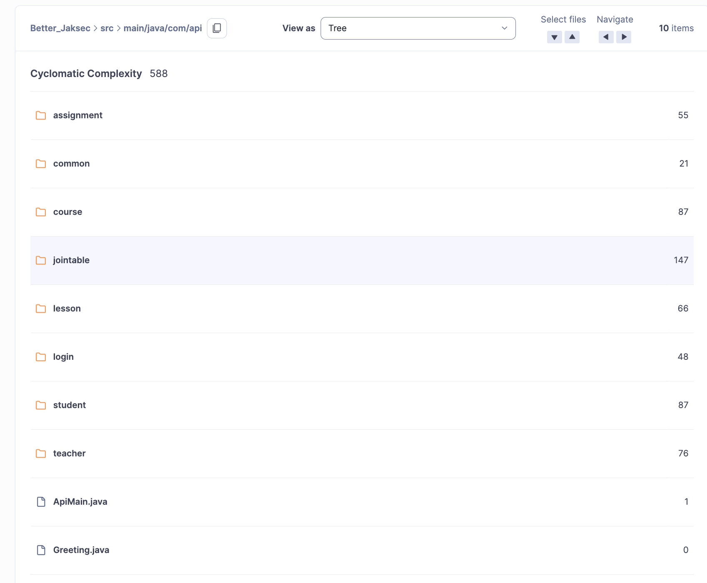
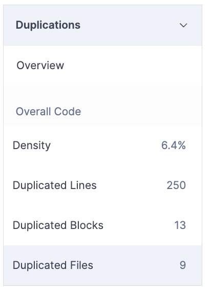
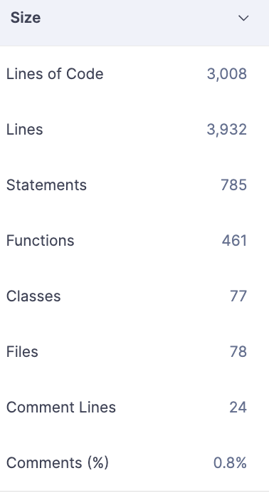

# Statistical Code Review Report 1

First SonarQube/SonarScanner report with no fixes made

## Project Information

- **Project name:** BetterJakSec
- **Team members:** Sakari Honkavaara, Leevi Laune, Elias Rinne
- **Analysis date:**

---

## 1. Purpose

The purpose of this report is to document the static code analysis results of the BetterJakSec project using SonarQube and SonarScanner. The goal is to identify code quality issues, complexity problems, duplicated code, and other maintainability or reliability concerns, and to provide recommendations for improvement.

---

## 2. Tools and Environment

- **Static analysis tool:** SonarQube Community Build
- **Scanner used:** SonarScanner / SonarScanner for Maven
- **SonarQube server URL:** `http://localhost:9000`
- **Java version:** 21
- **Build tool:** Maven
- **Operating system:** MacOS and Windows 11
- **Analysis command used:**
  ```bash
  mvn clean verify sonar:sonar -Dsonar.host.url=http://localhost:9000 -Dsonar.token=YOUR_TOKEN
  ```
  - Replace token with your personal token
  - This covers wider range of statistics such as code coverage and tests

---

## Report

### Summary Metrics

| Metric | Result |
|---|---:|
| Quality Gate | Passed |
| Security issues | 0 |
| Reliability issues | 5 |
| Maintainability issues | 90 |
| Coverage | 67.4% |
| Cyclomatic complexity | 588 |
| Lines of code | 3,008 |
| Total lines | 3,932 |
| Statements | 785 |
| Functions | 461 |
| Classes | 77 |
| Files | 78 |
| Comment lines | 24 |
| Comments (%) | 0.8% |
| Duplication density | 6.4% |
| Duplicated lines | 250 |
| Duplicated blocks | 13 |
| Duplicated files | 9 |

These results show that the project passes SonarQube's overall quality gate, but the codebase still contains a notable 
amount of maintainability issues and duplicated code. Security is currently in a good state, while reliability issues 
still require attention before the code can be considered stable and easy to maintain.

**Overview**



The overview shows that the project passed the Quality Gate. The project has no reported security issues and no security
hotspots, which is a positive result. However, the report still shows 5 reliability issues and 90 maintainability issues.
Test coverage is 67.4%, which means a large part of the code is covered by tests, but not enough to fully reduce the risk 
of regressions in more complex or duplicated areas.


**Issues**

*Security*



No security issues were found. Based on this report, there are also no security hotspots, so there are no urgent 
security-related corrective actions required at this stage.


*Reliability*



The reliability report shows 5 open issues, all of them classified as medium severity. This means the project has a 
limited number of possible bugs, but each of them should still be reviewed because reliability problems can affect 
correctness, runtime behavior, and user-facing stability. Even though the number is not high, these issues should be 
prioritized before low-severity maintainability clean-up.

Recommended actions for reliability issues:
- Review each of the 5 reported reliability findings individually in SonarQube.
- Fix possible logic errors, unsafe conditions, or edge-case handling problems first.
- Re-run the full test suite after each fix to confirm that behavior remains correct.


*Maintainability*



The maintainability report shows 90 open issues in total. Their severity distribution is:
- High: 19
- Medium: 16
- Low: 54
- Info: 1
- Blocker: 0

This indicates that the main quality problem in the project is maintainability rather than security or severe reliability 
defects. The 19 high-severity maintainability issues should be treated as the highest priority in the clean-up phase
because they are the most likely to reduce readability, increase technical debt, and make future changes harder.



No issues were reported for methods exceeding the configured long-method rule.



Filtering issues with the tag `unused` revealed **47 issues** related to unused code elements.  
These include unused imports and other unnecessary code fragments, which reduce maintainability and make the codebase harder to read and clean up.


No issues explicitly tagged with `dead` or `unreachable` were found in the reviewed SonarQube issue filters.

Recommended actions for maintainability issues:
- Resolve first all issues tagged as unused
- Resolve the 19 high-severity maintainability findings first.
- Refactor long or overly complex methods into smaller methods with single responsibilities.
- Improve naming consistency for methods, variables, and classes.
- Remove redundant logic and repeated code blocks.
- Add method-level comments where the purpose of the logic is not immediately clear.

### Key Findings and Prioritization

1. **Maintainability is the biggest issue area** with 90 open issues, including 19 high-severity findings.
2. **Code duplication is significant** at 6.4%, with 250 duplicated lines across 13 blocks and 9 files.
3. **Cyclomatic complexity is high overall** at 588, suggesting that some parts of the codebase are harder to test and maintain.
4. **Reliability still needs work** because 5 medium-severity issues may represent real bugs or fragile logic.
5. **Security is currently strong** because no security issues were reported.

**Measures**

*Complexity*



The overall cyclomatic complexity of the analyzed package is 588. The screenshot also shows that complexity is distributed unevenly across folders. The highest value in the screenshot appears in the `jointable` package (147), followed by `course` and `student` (87 each), `teacher` (76), `lesson` (66), and `assignment` (55). This suggests that the most complicated logic is concentrated in a few specific parts of the backend.

Interpretation:
- High complexity usually means more branches, conditions, and paths to test.
- Complex code is harder to read, debug, and modify safely.
- Packages with the highest complexity should be prioritized during refactoring.

Recommended actions for complexity:
- Review the `jointable`, `course`, `student`, and `teacher` packages first.
- Split complex methods into smaller helper methods.
- Reduce nested conditionals and repeated branching logic.
- Move reusable logic into shared utility or service methods where appropriate.

*Duplications*



The duplication report shows:
- Duplication density: 6.4%
- Duplicated lines: 250
- Duplicated blocks: 13
- Duplicated files: 9

This is an important maintainability concern. Duplicated code increases the risk of inconsistent fixes because the same logic may need to be updated in several places. It also makes the codebase larger and harder to maintain.

Recommended actions for duplications:
- Identify the 13 duplicated blocks in SonarQube and inspect them one by one.
- Extract repeated logic into common methods, shared services, or utility classes.
- Avoid copy-paste changes in controllers, services, or DTO/entity conversion logic.
- Re-run the analysis after refactoring to confirm that duplication density decreases.

*Lines of code*



The size measures show that the project contains 3,008 lines of code and 3,932 total lines, spread across 78 files and 77 classes. There are 461 functions and 785 statements. The report also shows only 24 comment lines, which equals 0.8% comments.

Interpretation:
- The codebase is moderate in size, but it contains many functions relative to the total amount of code.
- The low comment percentage suggests that some areas may be difficult to understand for new developers without reading the implementation directly.
- A larger number of functions is not automatically bad, but together with high complexity and duplication it may indicate that parts of the code structure should be simplified.

Recommended actions for code size and readability:
- Add comments to methods that contain non-obvious logic or business rules.
- Keep methods short and focused on one task.
- Review files with many responsibilities and split them if needed.
- Use consistent formatting and naming conventions across the project.

## Conclusion

The first static code review shows that BetterJakSec passes the SonarQube Quality Gate, but the project still contains 
important maintainability and reliability concerns. The most important follow-up actions are to resolve the reported 
reliability issues, reduce unused code, refactor the most complex packages, and remove duplicated logic. Security is 
currently in a good state, but the codebase still requires clean-up to improve readability, maintainability, and long-term stability.