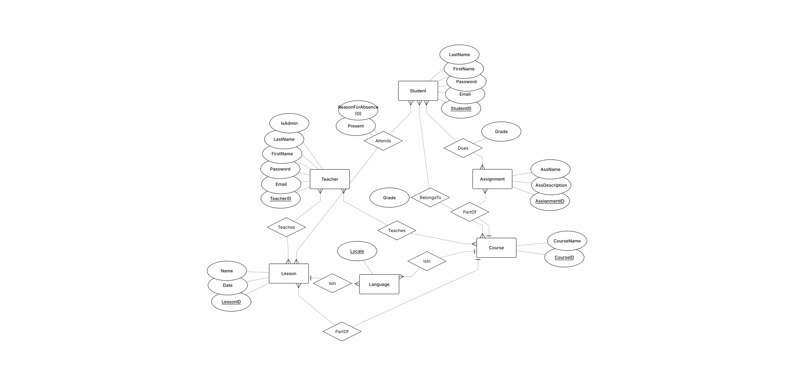

# Better_Jaksec

***This is backend repository. It contains our documenation also.***
***[Front end here](https://github.com/MustBeViable/BetterJaksec_frontend)***

**[Docker image in dockerhub](https://hub.docker.com/r/leevivl/better-jaksec-api)**

***Project Description***

Better jaksec provides a attendance tracking system for schools. It provides key features such:
  - For courses/lessons:
    - Creatin new
    - Updating already existing one
    - Deleting
  - Managing students in a course.
  - Attendance marking:
    - Teacher is able to mark students attendace manually in the browser
    - Student is able to mark it via QR-code
  - Attendance tracking and reports:
    - teacher can create report:
      - Individual course overall attendance percentage
      - Individual students attendance percentag per course/ per lesson
      - Individual students reason for absence
    - studen can:
      - Students own courses overal percentage
      - Check students own lessons reason for absence and mark it


-----------------------------------

***Project techstack***

**Frontend**

1. React
2. Vanilla CSS

Decision reasons:
  - Web application first approach reaches more users and less limitations
  - React enables us to create reactive web application
  - Vanilla css limits our dependecies.

-----------------------------------

**Backend**

1. Spring Boot for Rest API
2. Spring Data JPA

Decision reasons:
  - Spring Boot enables to use only one language at the backend and creating RESTful API authentication support, and seamless integration with the database.
  - Spring Data JPA enables to use modular API to database connection

-----------------------------------

**Database**

1. MariaDB/HeidiSQL

Decision reasons:
  - SQL based relational database to store information
  - MariaDB provides enough types

-----------------------------------

**Additional APIs, Framework etc**

1. [QR code API(html5-qrcode)](https://github.com/mebjas/html5-qrcode))
   - [React QR code for generating the QR code](https://www.npmjs.com/package/react-qr-code)
3. [Java JWT: JSON Web Token for Java and Android](https://github.com/jwtk/jjwt)

Decision reasons:
  - QR code for better and more robust way to let students mark their attendance.
  - JJWT for authentication and authorization (JWT-based authentication)

**i18n, l10n**

1. [react-i18n](https://react.i18next.com/)
2. chatgpt for translations
3. browser features

Supported languages
  - fi-FI
  - de-DE
  - en-US
  - ja-JP
  - zh-CN
  - fa-IR

Adding languages
  - in frontend repo add language file to src/i18n
  - if language is right to left add it to i18nDirections.js
  - add language to i18n/index.json
  - add language to LanguageSwitcher.jsx

Database localization
  - The localized tables have locale column indicating the locale of the row, this allows us to query content based on content
  - Since all rows on localized tables are user generated this approach is feasible since we have reasonable assumption no duplicates were to occur
  - "Duplicates" are handled as new entities with a different locale


updated ER diagram showing changes in data structure

-----------------------------------

## Running docker image locally
### Via docker-compose

Benefits of this way is that you dont need to have database locally setup, everything neded to run this application is created

Cons of this way is that you need to have 2 files copied for it

requirements
- docker compose is installed on the system
- docker-compose.yml and init.sql are copied and in the same folder

to bring up the services run
`docker-compose up -d`

- Some systems might use `docker compose` instead of `docker-compose`

to bring down the services run
`docker-compose down -v`

Default admin login is <br>
email=admin@example.com <br>
pass=adminpassword <br>

### Docker run

Benefits of this way is that its a single command and no file copying needed

Cons of this way is that you need to have a database setup locally (or remotely) yourself

requirements
- empty database w/ user with full access
- docker (+docker desktop on non linux systems) installed
- ability to make http requests, browser or curl easiest

to bring up the service run
```
docker run -d \
  --name better-jaksec-api \
  -e SPRING_DATASOURCE_URL=jdbc:mariadb://host.docker.internal:dbport/dbname \
  -e SPRING_DATASOURCE_USERNAME=dbuser \
  -e SPRING_DATASOURCE_PASSWORD=dbpass \
  -e SPRING_JPA_HIBERNATE_DDL_AUTO=update \
  -p external_port:8080 \
  leevivl/better-jaksec-api:latest
```

`dbport` mariadb default is 3306 <br>
`dbname` is the name of empty db <br>
`dbuser` name of the db user <br>
`dbpass` password of the db user <be>
`external_port` is what port you want to run the application, 8080 is a common one but might have some other service running there

after the service is running, send a request to <br>
`http://localhost:external_port/api/auth/admin/init`

Default admin login is <br>
email=admin@betterjaksec.com <br>
pass=adminpassword <br>

-----------------------------------

***Arichteture Design (ER and Use Case diagram) very short elaboration of the image***

Entity relation diagram:


  - Illustrates users and heir use cases for the program. Student councelor notification is not implemented.


  - Entity relation diagram made with [ERDplus](ERDplus.com). Picture illustrates entity relation diagram. Users have been divided to students and teachers. Teachers contain admins.

Relational schema:


  - Relational schema for our database. Database is created using object relational mapping when initiating API.
    

  - Class diagram example illustrates how a single endpoint is implemented, same class structure is applied for all
  - Include updated interface realization
    


- Sequence diagram showing student QR-based attendance marking flow through controller and service layers, including authentication and creation of an attendance record in the StudentLesson entity.


- Package diagram from course endpoint. Does not include whole import cycle -> would be hard to read


[Link to sprint report folder](https://github.com/MustBeViable/Better_Jaksec/tree/main/Documents/Sprint_reports)
